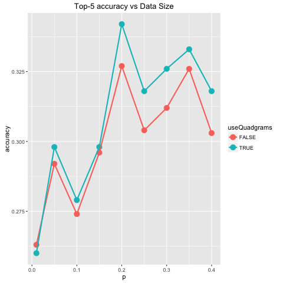

# Data Science Capstone (by Johns Hopkins University through Coursera)

This repository contains my work to the data science capstone project. It is the last course in the
[Data Science Specialization](https://www.coursera.org/specializations/jhu-data-science). In this
7-week project, we are asked to perform text mining, create a text prediction model, and build a
Shiny app which takes a phrase as input and predicts the next word.

# Data set

We will use the [capstone dataset](https://d396qusza40orc.cloudfront.net/dsscapstone/dataset/Coursera-SwiftKey.zip)
provided by SwiftKey. The files are named LOCALE.SOURCE.txt where LOCALE is the each of the four locales
*en_US*, *de_DE*, *ru_RU* and *fi_FI*, and SOURCE is *blogs*, *news*, or *twitter*. The data is from
a corpus called [HC Corpora](www.corpora.heliohost.org). See the readme file at [http://www.corpora.heliohost.org/aboutcorpus.html](http://www.corpora.heliohost.org/aboutcorpus.html)
for details on the corpora available. The files have been language filtered but may still contain some
foreign text.

# Download the data set

The raw data are stored in the folder `rawData` under the root directory of this reprository. Note
that the data files are not under version control. Sourcing the script file `downloadData.R` will
download and unzip the data file from the
[capstone dataset](https://d396qusza40orc.cloudfront.net/dsscapstone/dataset/Coursera-SwiftKey.zip).

Except for unzipping the file, we do not perform any processing or transformation to the files in
`rawData`. Transformed data will be stored in some other folders.

# Prepare the data

The file `data/prepareData.R` contains a single function `prepareData(p)`. The input argument can be
any number between 0 and 1, which indicates what fraction of data that we will use. (We suggest
using p = 0.2.) The function will sample from the documents in `rawData` and save the sampled
documents in, say `data/20` (if p = 0.2). In additional to sampling from the raw data, this function
will tokenize the sampled documents. The tokens will then be splitted into train tokens and test
tokens. These tokens will be saved in `trainTokens.rData` and `testTokens.rData`. These are simply
vectors of words (tokens) like the following.

```
 "i"       "ll"      "be"      "reading" "bad"     "poetry"  "and"     "waving"  "like"    "queen" 
```

# Compute n-gram frequencies

The file `nGramFreq/computeNGramFreq.R` contains a single function `computeNGramFreq(p)`. As before,
the input argument p indicates what fraction of data that we will use. Before running
`computeNGramFreq(p)`, please make sure to run `prepareData(p)` first. This function will create
two files `nGramFreq/20/freq.rData` and `nGramFreq/20/trimmedFreq.rData` (assuming that p = 0.2 for
the folder name).

The data file `freq.rData` contains three variables `bigramFreq`, `trigramFreq`, and `quadgramFreq`.
These are frequency tables for bigrams, trigrams, and quadgrams in the sampled documents.  The
frequency tables look like the following.

```
  i don t know   i m going to the end of the  i don t think  at the end of  can t wait to 
          2010           1621           1417           1343           1271           1271 
```

The data file `trimmedFreq.rData` also contains three variables `trimmedBigramFreq`,
`trimmedTrigramFreq`, and `trimmedQuadgramFreq`. The only difference is that n-grams with
frequency 1 are removed, as well as those contain special words {BEGIN} and {END} (these sepcial
words represet the begin and end of a line). In a typical n-gram frequency table, it is not unusual
that more than 80% of the n-grams have frequency 1, It means that the size of the trimmed frequency
tables are way smaller than the corresponding (untrimmed) frequency tables.

In this project, we always use trimmed frequency tables.

# Make predictions

Once the n-gram frequencies have been computed, we could use the `predictNextWord(...)` function in
`predict.R` to make predictions. Below we are loading the frequency tables obtained from 20% of the
raw data. (Actually, the frequency tables are constructed from 18% of the raw data, since 10% of the
sampled data are reserved for testing.)

```
> source('predict.R')
> load('nGramFreq/20/trimmedFreq.rData')
> nGramFreqList <- list(trimmedQuadgramFreq, trimmedTrigramFreq, trimmedBigramFreq)
> predictNextWord('say you love', nGramFreqList, maxNumPredictions = 5)
say you love me     you love me     you love it   you love your     you love to 
     1.00000000      0.17105263      0.07706767      0.07142857      0.06578947 
```

The first prediction "say you love me" are from the quadgram frequency table. The estimated
probability is 1, which means that all quadgrams in the training set which begin with "say you love"
are followed by the word "me". Note that the next few predictions are from the trigram frequency
table.

# Accuracy, performance, and model selection

We create the script files `evaluate.R` and `evaluateApp.R` to measure the accuracy and performance
of our predictive model so that we could come up with reasonable answers to the following questions.

1. How much raw data should we use? Should we use only 1%, 10%, or more?

2. In addition to bigrams and trigrams, should we use quadgrams in our model?

3. How many predictions should we make for each input phrase?

When we sample from the raw data, there is a parameter p in (0, 1) which indicates what fraction of
the raw data should be used. For example, with p = 0.2 we are using 20% of the raw data. In order to
evaluate the accuracy of the model, we reserve 10% of the sampled data for testing. From the testing
data, we randomly pick 1,000 quadgrams (regardless of whether we are are using quadgrams in our
model) and split each quadgram into a 3-word prefix and one word answer. Then, we make 5 predictions
for each of the 3-word prefexes. If the correct answer appears in any one of the 5 predicted words,
we count it as a success. Meanwhile, we could also obtain the mean prediction time.

</img>

</img>

Obviously, there is a trade-off between accuracy and performance. Based on the plots above, we decide
to use p = 0.2 and include quadgrams into our model.

Next, we vary the number of predictions to see how accuracy and performance are affected. In the
plots above, we make 5 predictions for each prefix. We expect to obtain higer accuracy with more
predictions.

</img>

</img>
